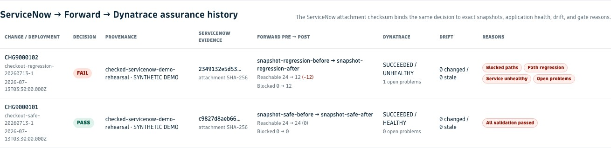

# Forward Integration for Dynatrace

Forward Integration for Dynatrace is a Forward Field Integration that turns Dynatrace application dependency evidence into
Forward-reviewed network intent-check packages, then gives an approved ServiceNow change one checksummed decision across
Forward modeled-network evidence and Dynatrace application health.

The integration keeps every authority boundary explicit: ServiceNow owns approval and audit, the customer's deployment
system owns deploy and rollback, Forward owns network intent, and Dynatrace owns application evidence. The Dynatrace app
does not write to Forward and does not store Forward credentials.

## Status

- Release: `v1.0.0`
- Runtime: Node.js 24.x
- Distribution: GitHub release artifacts and GHCR importer image
- Support model: field integration reference, not an officially supported Forward product integration
- License: ISC

## What It Does

- Reads Dynatrace service dependency evidence: application, environment, source, destination, protocol, port, owner,
  criticality, confidence, and mapping state.
- Builds deterministic Forward `NewNetworkCheck[]` intent-check packages with `dynatrace-key:*` reconciliation tags.
- Exposes package generation as a deployable Dynatrace custom Workflow action.
- Publishes validated package bytes to immutable filesystem handoff paths with an atomic `latest` pointer.
- Holds unresolved or ambiguous dependencies before Forward writes.
- Runs an optional Forward-side host-resolution preflight using Forward snapshot inventory so intent checks use
  resolved Forward host/subnet values.
- Optionally runs read-only Forward path evidence from the same resolved dependencies before import approval.
- Correlates sanitized aggregate Forward path evidence to a Dynatrace problem without asserting network root cause.
- Builds a deterministic read-only change-validation gate from Dynatrace health, Forward before/after path evidence,
  and sanitized reconciliation status.
- Emits bounded Forward-managed check-health transitions without publishing unchanged polling cycles.
- Includes systemd and Kubernetes schedules with durable state for continuous check-health feedback.
- Includes validated ServiceNow Flow Designer Script-step assets for start/status/complete change assurance.
- Correlates explicit Dynatrace vulnerability and Forward exposure evidence into a read-only investigation queue.
- Supports bulk create-missing-only imports through a Forward-side importer or scheduled connector.
- Optionally emits Forward NQE check and diff artifacts using Forward-controlled query IDs and allowlists.
- Publishes sanitized aggregate status back to Dynatrace for import state, counts, drift, signature state, and failures.

## What It Does Not Do

- The Dynatrace app does not mutate Forward.
- Dynatrace does not store Forward credentials.
- The importer does not auto-approve changed or stale Forward checks.
- Status events do not include Forward credentials, hostnames, check names, dependency rows, or Forward API response
  bodies.

## Architecture

```text
Dynatrace dependencies -> exported intent package -> Forward validates, reconciles, and applies
        ^                                                       |
        +---------------- sanitized aggregate status -----------+

ServiceNow approved change -> Forward-side assurance worker <- Dynatrace deployment and health
                                      |
                                      +-> pre/post Forward path evidence
                                      +-> checksummed decision -> ServiceNow + Dynatrace Grail
```

Both production paths remain Forward-centric at the write boundary. Dynatrace supplies dependency and application
evidence; Forward validates the target network snapshot before persistent checks are created and supplies the modeled
pre/post evidence used by the change gate. The integration reports the decision but never deploys or rolls back.

## Quick Start

```bash
git clone https://github.com/forwardnetworks/forward-dynatrace.git
cd forward-dynatrace
git checkout v1.0.0
npm ci
npm run ci
npm run acceptance:bundle -- \
  --dependencies shared/demo-dependencies.json \
  --output-dir out/acceptance \
  --sync-mode data-connector
```

The acceptance bundle is read-only. It builds a demo package, validates schemas and package integrity, writes
`ACCEPTANCE.md`, and does not contact Forward.

## Live Demo

The live-demo conductor runs the complete operator-controlled story against a Dynatrace trial tenant and a Forward
test network. It queries live Grail rows, selects a 12-flow showcase, resolves endpoints against the latest Forward
snapshot, runs read-only Forward bulk path analysis, builds the governed intent package, performs Forward
reconciliation, and creates a sanitized status handoff for Dynatrace.

```bash
export FORWARD_BASE_URL=https://forward.example.com
export FORWARD_USER=<user>
export FORWARD_PASSWORD=<password-or-token>
export FORWARD_NETWORK_ID=<network-id>

npm run demo:live -- \
  --dynatrace-environment-url https://<trial-sandbox-id>.apps.dynatrace.com/ \
  --dynatrace-token-file /secure/path/platform-token \
  --evidence-source approved-trial-replay \
  --synthetic \
  --output-dir /tmp/forward-dynatrace-live-demo
```

The checked default DQL reads replay events, so `--synthetic` is mandatory for this path. For customer-owned evidence,
supply `--dynatrace-query-file /secure/queries/customer-dependencies.dql`, set a truthful `--evidence-source`, and omit
`--synthetic`; replay markers fail closed before any Forward call. The default is a Forward dry-run; no checks are
created. Add `--apply` only after reviewing the report. Add
`--publish-dynatrace-status` to send the aggregate reconciliation event back to Dynatrace. Path analysis is read-only
and enabled by default for the demo; `--skip-path-evidence` is the explicit fallback when that permission is not
available. See [docs/live-demo-runbook.md](docs/live-demo-runbook.md) for rehearsal and meeting steps.

## Problem-Triggered Network Evidence

A Forward-controlled runtime can resolve the dependency candidates from a Dynatrace problem, run read-only bulk path
analysis, and create a sanitized `forward.dynatrace.network.evidence` event. The event contains problem/service/run and
network/snapshot identifiers plus aggregate outcomes; it excludes endpoints, devices, path rows, credentials, and API
response bodies. Generation is a dry-run by default, and Dynatrace publication requires a separate `--apply` gate.

See [docs/problem-network-evidence.md](docs/problem-network-evidence.md) for the exact commands, assessment semantics,
DQL views, and stop rules.

## Change-Validation Gate

`npm run forward:change-gate` combines Dynatrace deployment/service-health context, Forward before/after path evidence,
and Forward reconciliation status into a checksummed `pass`, `warn`, or `fail` artifact. It is read-only; enforcement
belongs to the customer's deployment system. See [docs/change-validation-gate.md](docs/change-validation-gate.md).

## ServiceNow-First Change Assurance

`npm run servicenow:change-workflow` captures the authoritative pre-deployment ServiceNow/Forward baseline, persists a
checksummed resume state across the customer-owned deployment, waits for a different processed Forward snapshot, and
then binds stabilized Dynatrace context to the final gate. ServiceNow is re-read before finalization, non-pass exits `2`
by default, publication is separately gated, and the companion ServiceNow assurance ledger makes retries idempotent
per exact evidence bundle. See
[docs/application-change-assurance.md](docs/application-change-assurance.md).

`npm run servicenow:flow-server` exposes the same tested two-phase workflow through an authenticated asynchronous API
for purchase-free ServiceNow core Script steps. It does not move the gate into ServiceNow or require IntegrationHub.
See [docs/servicenow-flow-worker.md](docs/servicenow-flow-worker.md).

For a non-production idempotency acceptance run, `--verify-servicenow-retry` explicitly resubmits the same checksummed
evidence and requires the second ServiceNow receipt to reuse both the original work-note and attachment sys_ids.

## Continuous Check-Health Feedback

`npm run forward:check-health` polls only integration-managed checks, stores hashed durable state in the Forward-side
runtime, and emits only failure, recovery, error, and missing transitions. Dynatrace publication is separately gated by
`--apply`. See [docs/check-health-transition-feedback.md](docs/check-health-transition-feedback.md).

## Security Exposure Correlation

`npm run security:correlate` joins explicit Dynatrace finding, Forward exposure, and approved identity-mapping evidence
into a ranked, read-only investigation queue. Low-confidence identity never produces high severity; facts remain
separate and no remediation occurs. See [docs/security-exposure-correlation.md](docs/security-exposure-correlation.md).

## Dynatrace App Install

For an unsigned trial or development install, use a `my.*` app ID:

```bash
npm run dynatrace:deploy -- \
  --environment-url https://your-environment-id.apps.dynatrace.com/ \
  --app-id my.forwardnetworks.dynatrace.field.integration \
  --no-open \
  --non-interactive
```

For an enterprise install with the default `com.forwardnetworks.dynatrace.field.integration` app ID, use
`--sign-archive` and provide Dynatrace App Toolkit signing OAuth credentials. Full install details are in
[docs/install.md](docs/install.md).

## Forward Import Workflow

Manual import is the first production-safe workflow because Forward writes happen only after a Forward operator reviews
the package.

1. Export dependency candidates from Dynatrace:
   - `dependencies.json`
   - optional NQE query metadata when the customer enables that path
2. Move or expose the dependency export to a Forward-controlled runtime.
3. Resolve Dynatrace host names against the target Forward snapshot:

   ```bash
   npm run forward:resolve-hosts -- \
     --dependencies dependencies.json \
     --forward-base-url https://forward.example.com \
     --forward-network-id <network-id> \
     --authorization-file /secure/path/read-only-forward-auth-header \
     --execute \
     --output resolved-dependencies.json \
     --report forward-host-resolution-report.json
   ```

4. Build the Forward package from the resolved dependency file:

   ```bash
   npm run forward:package -- \
     --dependencies resolved-dependencies.json \
     --output-dir out/forward-package
   ```

5. Validate the generated package without Forward credentials:

   ```bash
   npm run forward:import -- \
     --checks out/forward-package/forward-intent-checks.json \
     --manifest out/forward-package/forward-dynatrace-manifest.json \
     --validate-only
   ```

6. Optionally run read-only Forward path evidence before approval:

   ```bash
   npm run forward:path-evidence -- \
     --dependencies resolved-dependencies.json \
     --forward-base-url https://forward.example.com \
     --forward-network-id <network-id> \
     --authorization-file /secure/path/read-only-forward-auth-header \
     --execute \
     --output forward-path-evidence.json
   ```

7. Dry-run the resolved package against Forward:

   ```bash
   export FORWARD_BASE_URL=https://forward.example.com
   export FORWARD_USER=<user>
   export FORWARD_PASSWORD=<password-or-token>
   export FORWARD_NETWORK_ID=<network-id>

   npm run forward:import -- \
     --checks out/forward-package/forward-intent-checks.json \
     --manifest out/forward-package/forward-dynatrace-manifest.json \
     --report forward-import-report.json
   ```

8. Review create, unchanged, changed, stale, blocked, and failed rows.
9. Apply missing checks only after approval:

   ```bash
   npm run forward:import -- \
     --checks out/forward-package/forward-intent-checks.json \
     --manifest out/forward-package/forward-dynatrace-manifest.json \
     --apply
   ```

Scheduled automation uses the same importer from a Forward-side runtime with Forward credentials stored outside
Dynatrace. See [docs/forward-importer.md](docs/forward-importer.md) and
[docs/connector-runtime.md](docs/connector-runtime.md).

## Release Verification

Before installing or running release artifacts, verify the release:

```bash
gh release download v1.0.0 --repo forwardnetworks/forward-dynatrace
sha256sum -c SHA256SUMS
npm run release:sign -- \
  --verify \
  --checksums SHA256SUMS \
  --public-key SHA256SUMS.pub \
  --signature SHA256SUMS.sig
gh attestation verify forward-dynatrace-importer-v1.0.0.tgz \
  --repo forwardnetworks/forward-dynatrace
gh attestation verify oci://ghcr.io/forwardnetworks/forward-dynatrace-importer:v1.0.0 \
  --owner forwardnetworks
```

Verified importer image:

```text
ghcr.io/forwardnetworks/forward-dynatrace-importer@sha256:7f884e44a2b54303d7da708bc805f0e16c1d19b192f95a90e94a63aad66bb7c6
```

Release provenance, SBOM, Trivy scan evidence, and digest pinning guidance are in
[docs/release-provenance.md](docs/release-provenance.md) and [docs/container-runtime.md](docs/container-runtime.md).

## Screenshots

These checked, credential-free captures use synthetic rehearsal records and placeholder target metadata. Each
standalone evidence view labels that provenance; live Grail and customer-owned Forward/ServiceNow readback remain the
production proof sources.




## Development

Common commands:

```bash
npm run repo:validate
npm run schemas:validate
npm run forward:import:test
npm run forward:package:test
npm run runtime:validate
npm run demo:rehearsal
npm run demo:servicenow
npm run security:audit
npm run lint
npm run build
npm run ci
```

`npm run ci` is the local equivalent of the GitHub Actions `gitops` workflow.

`npm run demo:servicenow` creates a synthetic, read-only safe/regression rehearsal using the production ServiceNow
evidence, Forward gate, receipt, and Dynatrace event builders. Its `DEMO.md` includes the exact change IDs, snapshot
deltas, reason codes, and shared evidence checksums. It contacts no external system and never represents live proof.

For Dynatrace API smoke checks, keep platform tokens outside the repository and pass them with `DYNATRACE_TOKEN`,
`DYNATRACE_TOKEN_FILE`, or `--token-file`. Do not commit tenant URLs, access tokens, OAuth callback URLs, Forward
credentials, customer hostnames, or customer-specific references.

## Documentation

Start with the smallest useful map:

- [ARCHITECTURE.md](ARCHITECTURE.md): system boundaries, components, and primary data paths
- [docs/index.md](docs/index.md): task-oriented index of all detailed documentation
- [docs/exec-plans/active/customer-production-readiness.md](docs/exec-plans/active/customer-production-readiness.md): current execution plan
- [docs/validation-matrix.md](docs/validation-matrix.md): verified evidence and remaining live-validation gaps
- [docs/customer-one-pager.md](docs/customer-one-pager.md): customer-facing scope and verification

Repository layout:

```text
api/       Dynatrace app functions
config/    importer and connector config examples
deploy/    Docker Compose, Kubernetes, systemd, DQL, dashboard, and workflow templates
docs/      implementation, operation, security, release, and customer-facing docs
schemas/   JSON Schema contracts
scripts/   package builder, importer, validators, release tools, and test helpers
shared/    demo dependencies and sanitized status fixtures
ui/        Dynatrace app UI
```

## Security

The repository includes guardrails for tenant/customer data hygiene, schema validation, package signatures, release
checksums, attestations, SBOM generation, Trivy image scanning, and Forward-side create-missing-only defaults.

Relevant documents:

- [docs/data-handling.md](docs/data-handling.md)
- [docs/rbac.md](docs/rbac.md)
- [docs/package-handoff.md](docs/package-handoff.md)
- [docs/threat-model.md](docs/threat-model.md)
- [docs/governance.md](docs/governance.md)

## License

This project is licensed under the ISC License. See [LICENSE](LICENSE).
