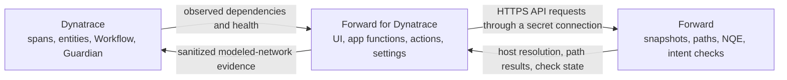

# Forward for Dynatrace

[](https://github.com/forwardnetworks/forward-dynatrace/actions/workflows/ci.yml)
[](https://github.com/forwardnetworks/forward-dynatrace/releases)
[](.node-version)
[](LICENSE)

Forward for Dynatrace converts observed application dependencies into governed network intent and modeled path
evidence. Application, network, and change teams can validate the same business-critical relationships before and
after a change while Dynatrace and Forward remain authoritative for their respective data.

> **Release channel:** `0.11.0` enterprise preview for controlled evaluation and non-production use. The release is
> delivered as one immutable Dynatrace app archive with checksums, an SBOM, and GitHub attestations.


## Business Outcomes

| Team | Outcome |
| --- | --- |
| Application and SRE | Convert current service relationships into network validation scope without manually recreating flows. |
| Network engineering | Add application context to Forward path analysis, intent checks, and pre/post-change assurance. |
| Change management | Gate execution and closeout on current application health and modeled network evidence. |
| Security and platform | Enforce least privilege, explicit write approval, bounded data exchange, and independently verifiable releases. |

## How It Works



The Dynatrace app is the only installable component. Forward communication is direct HTTPS API traffic from Dynatrace
app functions through a tenant-managed secret connection. The integration requires no Forward-side service,
container, agent, package, or browser-held credential.

## Capabilities

- Discover current service-to-service relationships from Dynatrace spans and entity context.
- Normalize application, environment, endpoint, protocol, port, owner, and evidence-time metadata through a
  tenant-owned discovery profile.
- Resolve endpoints and evaluate modeled paths against the latest processed Forward snapshot.
- Build deterministic intent-check plans with create, update, unchanged, stale, collision, and mapping counts.
- Create missing checks and update changed managed checks only after exact Network Admin approval.
- Keep stale checks report-only; synchronization has no implicit delete path.
- Run allowlisted Forward Library NQEs or reviewed arbitrary NQEs according to the selected Forward access profile.
- Correlate Forward reachability with Dynatrace Site Reliability Guardian results while preserving each platform's
  source-of-truth boundary.

## Access Profiles And Change Control

Each connection binds one Forward network and one declared access profile. A more privileged credential never upgrades
a plan-only request.

| Forward profile | Evidence access | Intent-check behavior |
| --- | --- | --- |
| Read Only | Modeled state, checks, paths, and approved Library NQEs by ID | Plan only; no writes |
| Network Operator | Read Only plus arbitrary NQE execution permitted by Forward RBAC | Plan only; no writes |
| Network Admin | Full evidence plus managed intent-check reconciliation | Exact-approved create and update only |

Network Admin apply requires the immutable plan digest, the same processed snapshot, explicit mutation budgets, exact
approval of every changed managed source key, zero ownership collisions, and successful post-write readback.

## Security And Governance

- Forward credentials are secret Dynatrace app settings and are loaded only by app functions.
- Forward API targets require HTTPS, the exact `/api` root, and tenant outbound-host approval.
- Requests use strict schemas, timeouts, bounded retries, response-size limits, concurrency limits, and mutation budgets.
- Plans bind the network, snapshot, access profile, managed identities, and canonical check fingerprints.
- Unmanaged checks are never adopted by name; partial failure stops the apply and requires a new plan.
- Browser and Workflow results exclude credentials, authorization headers, raw authenticated errors, complete inventory,
  and detailed path topology.
- Every release contains an app archive, CycloneDX SBOM, SHA-256 checksums, optional detached signature, and GitHub
  artifact attestations.

See [Architecture](ARCHITECTURE.md), [RBAC](docs/rbac.md), [Data handling](docs/data-handling.md), and
[Threat model](docs/threat-model.md) for the complete control boundary.

## Install An Immutable Release

### Prerequisites

- Dynatrace SaaS with AppEngine and Workflow enabled.
- Permission to install custom apps, manage app settings, and approve the Forward API host under
  **Settings > General > External requests**.
- A dedicated Forward service identity and a network with a processed snapshot.
- Node.js 24 and an authenticated GitHub CLI for the supplied verification and installation tooling.

### 1. Download And Verify

The `/secure` path below is an example. Use an operator-owned directory with permissions appropriate for release
evidence in your environment.

```bash
export RELEASE_TAG=v0.11.0
mkdir -p "/secure/forward-dynatrace/${RELEASE_TAG}"
cd "/secure/forward-dynatrace/${RELEASE_TAG}"

gh release download "${RELEASE_TAG}" \
  --repo forwardnetworks/forward-dynatrace
sha256sum -c SHA256SUMS
gh attestation verify "forward-dynatrace-app-${RELEASE_TAG}.zip" \
  --repo forwardnetworks/forward-dynatrace
```

### 2. Install The Verified Archive

Use the installer from the same immutable tag. Keep OAuth values in the environment or an approved secret manager;
never place them on a shared command line, in source control, or in Workflow JSON.

```bash
git clone https://github.com/forwardnetworks/forward-dynatrace.git
cd forward-dynatrace
git checkout "${RELEASE_TAG}"
npm ci

export DT_APP_OAUTH_CLIENT_ID=<protected-client-id>
export DT_APP_OAUTH_CLIENT_SECRET=<protected-client-secret>

npm run dynatrace:release:install -- \
  --environment-url https://<environment-id>.apps.dynatrace.com/ \
  --archive "/secure/forward-dynatrace/${RELEASE_TAG}/forward-dynatrace-app-${RELEASE_TAG}.zip" \
  --checksums "/secure/forward-dynatrace/${RELEASE_TAG}/SHA256SUMS"
```

The installer verifies checksum membership, archive identity, required app functions, settings schemas, and Workflow
actions before upload, then waits for the exact version to become ready in the AppEngine Registry.

For upgrades, rollback, signed-app identity, and tenant scopes, see the [installation guide](docs/install.md).

## Configure


1. Approve the exact Forward API hostname in Dynatrace external requests.
2. Create a **Dependency discovery profile** with reviewed spans-only DQL and an explicit freshness window.
3. Create a **Forward API connection** with the exact `/api` URL, network ID, dedicated identity, secret password, and
   declared access profile.
4. Open **Apps > Forward**, select the discovery profile, and confirm current dependency and mapping evidence.
5. Add **Synchronize Forward intent checks** to an on-demand Workflow and begin with `operation: plan` under Read Only.
6. Add Network Admin apply only after approval ownership, budgets, and post-change closeout policy are established.

The [enterprise evaluation guide](docs/evaluation-guide.md) provides a complete click-by-click acceptance sequence.

## Operate

A normal change-assurance cycle is:

1. Refresh current Dynatrace dependencies and select the latest processed Forward snapshot.
2. Run a plan and review mapping gaps, modeled-path results, collisions, reconciliation counts, and the plan digest.
3. Approve and apply only the exact Network Admin plan when writes are required.
4. Collect a post-change Forward snapshot and rerun the same evidence scope.
5. Run the associated Site Reliability Guardian validation.
6. Close the change only when the required Forward and Dynatrace objectives pass.

See the [workflow guide](docs/workflow.md), [operations runbook](docs/operations-runbook.md), and
[Site Reliability Guardian integration](docs/site-reliability-guardian.md).

## Release Integrity

GitHub prereleases publish exactly one Dynatrace app archive plus verification evidence. The project does not publish a
container image, operating-system package, Python package, or Forward-side runtime. Published tags are immutable; any
change requires a new version.

See [Release process](docs/release.md) and [Release provenance](docs/release-provenance.md).

## Development

```bash
npm ci
npm run ci
npm run start
```

Node.js 24 is the supported development runtime. `npm run ci` validates schemas, security controls, Workflow and
Guardian assets, scale behavior, release integrity, linting, builds, and the installable archive.

Repository layout:

```text
api/       Dynatrace app functions
actions/   Workflow actions, widgets, and connection contracts
ui/        Dynatrace application UI
lib/       discovery, evidence, identity, and access policy
schemas/   API payload and evidence contracts
deploy/    Workflow, DQL, dashboard, and Guardian assets
scripts/   validation, packaging, installation, and release tooling
docs/      architecture, security, operations, and integration guides
```

See [Contributing](CONTRIBUTING.md) and the [documentation index](docs/index.md).

## License

[ISC](LICENSE)
