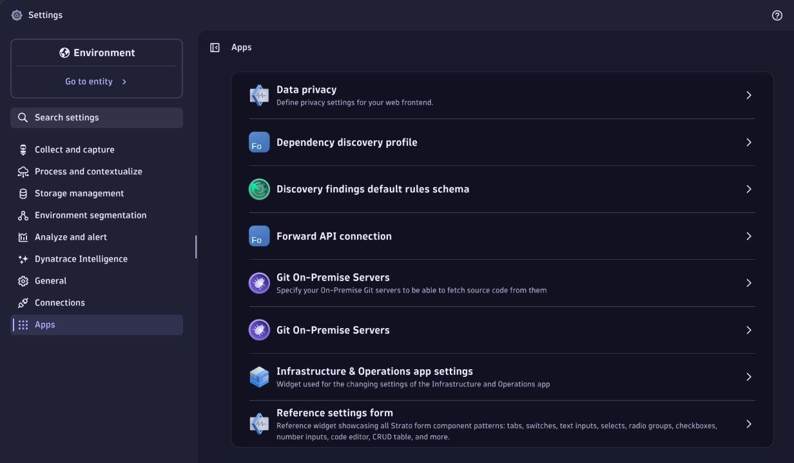
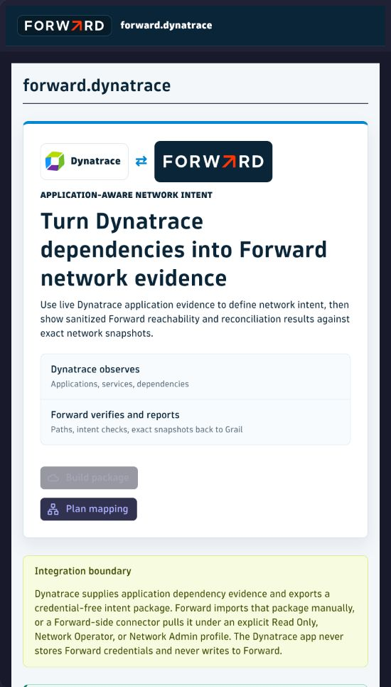

# Enterprise Evaluation Guide

This guide installs one immutable Forward for Dynatrace release, configures tenant-owned discovery and Forward access,
and completes a Read Only acceptance cycle before any write-enabled workflow is considered.

## Required Owners

The Dynatrace administrator provides:

- a Dynatrace SaaS environment with AppEngine and Workflow;
- an OAuth client with `app-engine:apps:install` and `app-engine:apps:run`;
- permission to manage app settings and the outbound-host allowlist;
- a reviewed spans-only DQL mapping for the applications in scope.

The Forward administrator provides:

- a dedicated Read Only service identity;
- the exact Forward API root and network ID;
- a processed snapshot for the target network;
- optional committed Library NQE query IDs approved for the connection.

Never send OAuth, Forward, or telemetry-ingest secrets through source control, Workflow JSON, meeting chat, or the app
UI.

## 1. Verify The Release

```bash
export RELEASE_TAG=v0.12.0
mkdir -p "/secure/forward-dynatrace/${RELEASE_TAG}"
cd "/secure/forward-dynatrace/${RELEASE_TAG}"

gh release download "${RELEASE_TAG}" \
  --repo forwardnetworks/forward-dynatrace
sha256sum -c SHA256SUMS
gh attestation verify "forward-dynatrace-app-${RELEASE_TAG}.zip" \
  --repo forwardnetworks/forward-dynatrace
```

Expected: the app archive and SBOM match `SHA256SUMS`, and GitHub verifies the app archive provenance.

## 2. Install The Exact Archive

Check out the same immutable tag for the verified installer:

```bash
git clone https://github.com/forwardnetworks/forward-dynatrace.git
cd forward-dynatrace
git checkout "${RELEASE_TAG}"
npm ci

export DT_APP_OAUTH_CLIENT_ID=<protected-client-id>
export DT_APP_OAUTH_CLIENT_SECRET=<protected-client-secret>

npm run dynatrace:release:install -- \
  --environment-url https://<environment-id>.apps.dynatrace.com/ \
  --archive "/secure/forward-dynatrace/${RELEASE_TAG}/forward-dynatrace-app-${RELEASE_TAG}.zip" \
  --checksums "/secure/forward-dynatrace/${RELEASE_TAG}/SHA256SUMS"
```

Expected: the registry reports the exact app ID and version as ready. The installer never prints the OAuth token.

## 3. Approve The Forward Host

1. Open **Settings > General > External requests**.
2. Under **Allowlist**, click **New host pattern**.
3. Enter only the approved Forward API hostname; do not include `/api`, credentials, or a wildcard.
4. Click **Add** and confirm the host appears in the table.

## 4. Configure Dependency Discovery



1. Open **Settings > Apps > Dependency discovery profile**.
2. Click **New object**.
3. Enter the profile name and scope description.
4. Set **Status** to **Enabled** and **Selection** to **Default**.
5. Paste reviewed spans-only DQL based on `deploy/dynatrace-dql/otel-span-dependencies.dql`.
6. Set explicit row and evidence-age limits, then save.

Expected: exactly one profile is the default, and its Notebook review returns current source, destination, protocol,
port, application, environment, owner, and evidence-time values.

## 5. Configure Read Only Forward Access

1. Open **Settings > Apps > Forward API connection**.
2. Click **New object**.
3. Enter a connection name, the HTTPS Forward URL ending in `/api`, and the exact network ID.
4. Enter the dedicated service username and secret password.
5. Select **Read Only**.
6. Add only approved committed Library NQE query IDs when NQE evidence is in scope.
7. Save and reopen the object to confirm the secret remains masked.

Expected: no credential appears in the browser URL, Workflow definition, or app result.

## 6. Verify Current Discovery



1. Open **Apps > Forward**.
2. Select the reviewed discovery profile.
3. Click **Refresh closed-loop evidence**.
4. Confirm the source banner reports current Dynatrace span dependencies.
5. Review accepted, review-required, unmapped, freshness, and mapping-readiness counts.

Expected: only current telemetry appears. Review-required and unmapped rows remain ineligible for automatic apply.

## 7. Run A Read Only Plan

1. Open **Workflows** and create an **On demand** workflow.
2. Add **Synchronize Forward intent checks**.
3. Select the Read Only connection.
4. Use `deploy/dynatrace-workflows/forward-sync-on-demand.payload.example.json` as the request shape.
5. Keep `syncMode` as `direct-api`, `forwardAccessProfile` as `read-only`, `operation` as `plan`, and
   `runPathPreflight` as `true`.
6. Save, run, and open the task **Result** tab.

Expected: the task succeeds; target snapshot, mapping, path, and reconciliation counts are present; mutation counts are
zero; credentials, raw API bodies, endpoint inventory, and detailed path topology are absent.

## 8. Validate Guardian Correlation

Run the scoped Site Reliability Guardian and confirm its objectives distinguish application health from Forward
modeled reachability. Both evidence sources may contribute to a change gate; neither is presented as root cause by
itself.

## 9. Record Acceptance

Complete `docs/templates/customer-acceptance-record.md`. Record the release, app identity, connection profile,
discovery profile, evidence window, snapshot, aggregate counts, Workflow execution, defects, and ownership. Do not
copy credentials, tenant URLs, dependency rows, endpoints, or path topology into this repository.

## Promotion Gate

Do not enable Network Admin apply until the organization approves mapping ownership, mutation budgets, separation of
duties, incident response, rollback, and post-change closeout. Scheduled workflows and enforcement are separate
promotion decisions.
