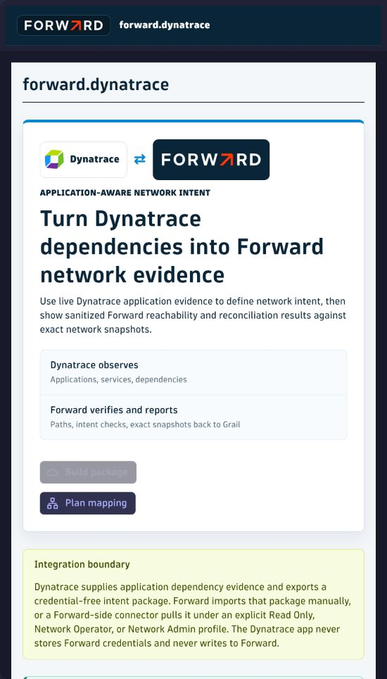

# Dynatrace Sandbox Enablement Runbook

Published pilot baseline: **v0.13.4**. Source build: **v0.13.7**.

Use this customer-neutral runbook to enable Forward for Dynatrace in a non-production Dynatrace SaaS sandbox. Start
with a dedicated Forward Read Only identity and an on-demand `operation: plan` Workflow. Do not add a schedule or use
Network Admin during initial acceptance.

## 1. Collect The Prerequisites

Obtain these values through the approved protected channel:

- the verified Forward for Dynatrace app archive;
- the normal Forward HTTPS tenant URL, such as `https://fwd.app`;
- the Forward network ID for the isolated evaluation workspace;
- a dedicated Forward Read Only token access key and secret;
- confirmation that the workspace has a current `PROCESSED` snapshot; and
- an application/environment scope that has current Dynatrace network-flow or distributed-trace telemetry.

Never paste the token secret into a Workflow, Notebook, app setting, screenshot, ticket, or chat.

## 2. Install Or Verify The App

1. Open **Apps > Dynatrace Hub**.
2. Search for **Forward**.
3. Install the verified release, or confirm the installed app reports the expected version and registry status.
4. Open the app and require the **Forward for Dynatrace** page to load without an authorization error.

Follow [Installation](install.md) for archive verification, OAuth scopes, upgrade, and rollback.

## 3. Create The Credential Vault Entry

1. Open **Credential Vault** and select **Add new credential**.
2. Choose **User and password**.
3. Enter the Forward token access key as **Username** and the token secret as **Password**.
4. Select **AppEngine** scope.
5. Restrict app access to `my.forward` or `com.forward.dynatrace` when the tenant selector supports it.
6. Keep **Allow access without app context** off.
7. Keep owner-only user access unless another named Workflow operator is approved.
8. Save and record only the `CREDENTIALS_VAULT-*` entity ID.

An unsigned preview tenant that exposes only **All applications** may use that value as a documented sandbox exception.
It remains a production blocker.

## 4. Create The Forward Connection

Under **Settings > Apps > Forward API connection**, add:

| Field | Required value |
| --- | --- |
| Connection name | Stable sandbox label |
| Forward URL | Normal HTTPS tenant URL without a path; the app adds `/api` internally |
| Forward network ID | Isolated evaluation workspace ID |
| Credential Vault ID | Complete `CREDENTIALS_VAULT-*` entity ID |
| Forward access profile | **Read Only** |
| Approved Library NQE IDs | Only reviewed `FQ_*` IDs needed for the NQE smoke |

Existing saved URLs ending in `/api` remain valid and normalize to the same internal API root. Do not enter any other
path. TLS verification must remain enabled. Private or internal-CA endpoints require EdgeConnect with the CA configured.

## 5. Run The Non-Mutating Connection Diagnostic

Source version v0.13.5 adds this positive control:

1. Open **Apps > Forward**.
2. In **Forward Connection Diagnostic**, select the saved connection.
3. Select **Test connection**.
4. Require `ready` for configuration, Credential Vault, verified HTTPS, authentication, network access, processed
   snapshot, and Read Only pilot.
5. If blocked, retain the correlation ID and bounded reason code. Do not capture credentials or raw Forward responses.

Published v0.13.4 does not contain this button. For that release, the first on-demand Read Only plan is the connection
positive control.

## 6. Prove Azure Inventory Without Calling It Application Flow

When Azure is monitored in both products, use the two mapping queries:

- [`azure-smartscape-inventory.dql`](../deploy/dynatrace-dql/azure-smartscape-inventory.dql)
- [`azure-smartscape-relationships.dql`](../deploy/dynatrace-dql/azure-smartscape-relationships.dql)

Run them in a Dynatrace Notebook and review row counts and representative entity types. Smartscape nodes and edges
prove inventory and relationship mapping only. They do not contain authoritative application source, destination,
TCP/UDP protocol, and destination port evidence.

## 7. Create And Validate The Dependency Discovery Profile

Prefer current OneAgent network-flow telemetry for the infrastructure-centric Azure pilot:

1. Copy [`oneagent-network-flow-dependencies.dql`](../deploy/dynatrace-dql/oneagent-network-flow-dependencies.dql) into a
   Dynatrace Notebook.
2. Narrow the query to the approved application and environment.
3. Run it against the current time window.
4. Require every retained row to include source, destination, `tcp` or `udp`, destination port, application,
   environment, owner, evidence timestamp, and reviewed mapping state.
5. If zero rows return, stop. Confirm OneAgent network connection monitoring, generate an approved application
   transaction, and check the retention window. Do not substitute Smartscape edges.
6. Save the reviewed query under **Settings > Apps > Dependency discovery profile** with **OneAgent network flows** as
   the source and a bounded maximum evidence age.
7. Open **Apps > Forward**, select the profile, and refresh closed-loop evidence. Review accepted and rejected counts.

Use [`otel-span-dependencies.dql`](../deploy/dynatrace-dql/otel-span-dependencies.dql) only when distributed traces are
authoritative for the same endpoint contract.

## 8. Build The On-Demand Read Only Workflow

1. Create an **On demand** Workflow. Do not add a schedule.
2. Add **Execute DQL query** as `query_dependencies` and use the reviewed discovery query.
3. Add **Synchronize Forward intent checks** after the query.
4. Select the saved Read Only connection.
5. Start from the repository's
   [`forward-sync-on-demand.payload.example.json`](../deploy/dynatrace-workflows/forward-sync-on-demand.payload.example.json).
6. Keep `operation` set to `plan`, `runPathPreflight` set to `true`, and mutation approvals empty.
7. Set `dependencies` from `result("query_dependencies")["records"]`.
8. Select **Use staged plan request** before saving or deploying. The editor draft is not active until staged.

## 9. Run And Verify The Plan

Run the Workflow once and require:

- overall Workflow and both tasks report **Success**;
- the selected connection reports **Read Only** and `operation: plan`;
- host resolution has no ambiguous or unresolved endpoints;
- modeled-path evidence is completed with no failed, ambiguous, or unmapped rows;
- the selected Forward snapshot is processed;
- reconciliation counts and plan digest are present; and
- `mutationCounts.created = 0` and `mutationCounts.updated = 0`.

A green Workflow is necessary but insufficient. Inspect the Forward task **Result** and its `pathEvidence`,
`hostResolution`, access profile, operation, and mutation counts.

## 10. Run The Approved NQE Smoke Separately

1. Add **Run Forward NQE evidence** to a separate on-demand Workflow.
2. Select the same Read Only connection.
3. Choose **Approved Library query** and enter an allowlisted `FQ_*` query ID.
4. Keep `maxRows` bounded.
5. Run the async request and require submit, poll, and sanitized result completion.
6. If the execution remains pending, use **Resume async execution** with only the server-issued execution key.

NQE proves the NQE surface only. It does not replace dependency discovery or modeled-path preflight.

## 11. Evidence To Retain

Retain only the app version/status, connection label and Read Only profile, protected execution identifiers, aggregate
discovery and rejection counts, snapshot state, host/path aggregate counts, NQE aggregate status, and zero mutation
counts. Keep credentials, tenant URLs, network IDs, endpoints, hostnames, raw dependency rows, and raw API bodies out
of the repository and group chat.

Use [Customer acceptance](customer-acceptance-checklist.md) for promotion and
[Azure Smartscape pilot](azure-smartscape-pilot.md) for the Azure-specific evidence boundary.
