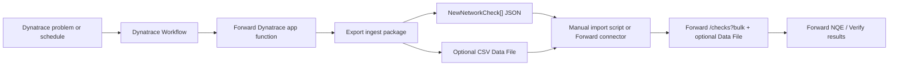

# Forward Dynatrace Workflow

This app uses Dynatrace application dependency mapping to fill Forward intent checks. Dynatrace is the source of
application dependency evidence; Forward is the system that stores, evaluates, and reports the network intent.

This repository is an art-of-the-possible demonstration. It builds Forward-ready payloads and a production API plan,
but the Dynatrace app must not mutate a Forward tenant. Forward-side manual import or a Forward-owned data connector
owns all Data File and intent-check writes.

## What the Dynatrace App Provides

- A focused view of Dynatrace application dependencies that are candidates for Forward intent.
- A proof action that turns a Dynatrace service/problem context into a Forward path query.
- An export action that stages Forward-ready artifacts:
  - `forward-intent-checks.json` as Forward-native `NewNetworkCheck[]` for bulk intent import.
  - `forward-dynatrace-manifest.json` with schema version, counts, dedupe policy, and artifact names.
  - Optional `dynatrace_service_dependencies.csv` for NQE and inventory-style analysis.
- A Workflow-compatible app function that can run without a human clicking the UI.

## Recommended Production Flow



## Screenshots

### 1. Dynatrace Mapping Becomes Forward Intent Candidates

The app starts from Dynatrace application dependencies, not generic infra telemetry.


### 2. Build A Forward Export Package

The workflow produces an export package first: row counts, readiness gates, bulk-check JSON, manifest, and optional
Data File artifacts. No Forward writes happen inside Dynatrace.


### 3. Forward-Side Bulk Check Ingest

Eligible rows become Forward-native `NewNetworkCheck[]` JSON. Forward manual import or a Forward-owned connector
executes the API calls.


### 4. Forward-Side Persistent Intent Checks

Eligible dependency rows become persistent `Existential` checks with deterministic tags for dedupe, created by
Forward-side ingest.


## Standard Forward-Centric Ingest Sequence

1. Dynatrace app exports dependency rows from Dynatrace services, spans, tags, or ownership metadata.
2. Dynatrace app exports:
   - `NewNetworkCheck` JSON.
   - Manifest JSON.
   - Optional CSV Data File content.
   - Optional DataFileCreateRequest metadata.
   - deterministic `integration_key` values.
3. Forward operator imports the package, or Forward-owned connector pulls it.
4. Forward-side ingest resolves the snapshot where checks should be created:

   `GET /api/networks/{networkId}/snapshots/latestProcessed`

5. Forward-side ingest dedupes existing Dynatrace-managed checks:

   `GET /api/snapshots/{snapshotId}/checks?type=Existential`

   Match by deterministic check name or `dynatrace-key:*` tag.

6. Forward-side ingest creates missing persistent intent checks in bulk:

   `POST /api/snapshots/{snapshotId}/checks?bulk`

   Body is `NewNetworkCheck[]`. Persistence defaults to true in Forward's API.

7. Forward-side ingest reads back status:

   `GET /api/snapshots/{snapshotId}/checks?type=Existential`

8. Optional: Forward-side ingest creates or updates the org-level Data File:

   `POST /api/data-files`

   This is a multipart request with:
   - `file`: generated CSV.
   - `request`: JSON metadata such as name, NQE name, file type, description, and headers.

9. Optional: Forward-side ingest replaces existing Data File contents:

   `POST /api/data-files/{dataFileName}`

10. Optional: Forward-side ingest attaches the data file to the target Forward network:

   `POST /api/networks/{networkId}/data-files/{dataFileName}`

## Intent Check Mapping

The first useful mapping is one Forward `Existential` check per eligible Dynatrace dependency:

```json
{
  "name": "[Dynatrace] Checkout prod: checkout-vip -> orders-db tcp/443",
  "enabled": true,
  "priority": "HIGH",
  "tags": [
    "dynatrace",
    "app:Checkout",
    "environment:prod",
    "owner:commerce-platform",
    "dynatrace-key:dt:checkout:prod:service-1234567890:checkout-vip:orders-db:tcp:443"
  ],
  "note": "Generated from Dynatrace service checkout-api; serviceEntityId=SERVICE-1234567890; integrationKey=dt:checkout:prod:service-1234567890:checkout-vip:orders-db:tcp:443",
  "definition": {
    "checkType": "Existential",
    "filters": {
      "from": {
        "location": {"type": "HostFilter", "value": "checkout-vip"},
        "headers": [
          {
            "type": "PacketFilter",
            "values": {"ip_proto": ["6"]}
          },
          {
            "type": "PacketFilter",
            "values": {"tp_dst": ["443"]}
          }
        ]
      },
      "to": {"location": {"type": "HostFilter", "value": "orders-db"}},
      "flowTypes": ["VALID"]
    },
    "headerFieldsWithDefaults": ["url"],
    "noiseTypes": [],
    "returnPath": "ANY"
  }
}
```

Use `Reachability` checks when the dependency must be delivered to the destination host or prefix. Use `NQE` checks
when the question is broader than one path, such as dependency coverage, device exposure, segmentation drift, or
snapshot-wide compliance.

Rows with `needs-map` status should not create Forward checks. Keep them in the optional Data File for review, or
reject them from automated import until source/destination mapping is complete.

## Workflow Option A: Manual Export And Import

1. Dynatrace operator builds the package and downloads:
   - `forward-dynatrace-manifest.json`
   - `forward-intent-checks.json`
   - optional `dynatrace_service_dependencies.csv`
   - optional `forward-data-file-request.json`
2. Forward operator places those artifacts in a Forward-controlled environment.
3. Forward operator runs a dry-run:

   `npm run forward:import -- --checks forward-intent-checks.json`

4. Forward operator reviews planned creates and existing matches.
5. Forward operator applies:

   `npm run forward:import -- --checks forward-intent-checks.json --apply`

6. Optional Data File import:

   `npm run forward:import -- --checks forward-intent-checks.json --data-file dynatrace_service_dependencies.csv --data-file-request forward-data-file-request.json --attach-data-file --apply`

## Workflow Option B: Forward-Owned Data Connector

1. Dynatrace app or Dynatrace Workflow writes the latest export package to a connector-readable location.
2. Forward-owned connector authenticates to Dynatrace with read-only access and pulls the package.
3. Connector validates:
   - `schemaVersion`
   - package age
   - row/check counts
   - required fields
   - allowed check type and tag shape
4. Connector resolves the Forward network and latest processed snapshot.
5. Connector reads existing Forward intent checks.
6. Connector dedupes by exact check name or `dynatrace-key:*` tag.
7. Connector posts only missing checks to `/api/snapshots/{snapshotId}/checks?bulk`.
8. Connector optionally updates the Data File for NQE/audit.
9. Connector writes import status back to Forward logs, and optionally exposes read-only status in Dynatrace.

## Dynatrace Workflow Triggers

Problem trigger:
- Read impacted service/entity context.
- Query related dependencies for the service and timeframe.
- Export Forward ingest package only for impacted rows.
- Optionally show package generation status in Dynatrace.

Schedule trigger:
- Refresh all critical production dependencies.
- Refresh the export package.
- Forward-owned connector decides whether to import the updated package.

## Runtime Requirements

- Dynatrace app scope for reading entities and related observability context.
- No Forward write credentials stored in Dynatrace.
- Forward-owned connector or Forward operator owns Forward credentials.
- Idempotency keys or deterministic check names so Forward-side import skips existing checks instead of duplicating them.
- A policy for check ownership, retirement, and exception handling.
