# Forward for Dynatrace Workflow

This app uses Dynatrace application dependency mapping to fill Forward intent checks. Dynatrace is the source of
application dependency evidence; Forward is the system that stores, evaluates, reconciles, and reports the network
intent.

This repository contains the pre-1.0 design-partner Forward for Dynatrace integration. The Dynatrace app must not mutate
a Forward tenant. Forward-side manual import or a Forward-side connector owns all intent-check writes.

## What the Dynatrace App Provides

- A focused view of Dynatrace application dependencies that are candidates for Forward intent.
- A path preview action that turns a Dynatrace service/problem context into a Forward path query.
- An optional profile-aware NQE preview action that plans approved `POST /api/nqe` requests without Forward credentials
  or Forward network calls in Dynatrace. Read Only uses a Forward Library query ID; Network Operator and Network Admin
  may use approved arbitrary NQE templates.
- An export action that stages Forward-side ingest input:
  - dependency candidates with source, destination, protocol, port, ownership, confidence, and mapping state.
  - optional NQE metadata when the customer enables the query-ID artifact path.
- A Workflow-compatible app function that can run without a human clicking the UI.

## Recommended Production Flow

```mermaid
flowchart LR
    A["Dynatrace problem or schedule"] --> B["Dynatrace Workflow"]
    B --> C["Forward for Dynatrace app function"]
    C --> D["Export dependency candidates"]
    D --> E["Manual import script or Forward connector"]
    E --> F["Forward host resolution"]
    F --> G["Build manifest + NewNetworkCheck[]"]
    G --> H["Sign and validate package"]
    H --> I["Forward reconcile"]
    I --> R{"Selected profile"}
    R -->|"Read Only / Network Operator"| S["Publish reconciliation only"]
    R -->|"Network Admin create-missing"| J["Forward /checks?bulk"]
    R -->|"Network Admin update / retire"| P["Stage immutable plan"]
    P --> Q["Exact operator approval"]
    Q --> J
    J --> K["Post-apply reconciliation"]
```



## Standard Forward-Centric Ingest Sequence

1. Dynatrace app exports dependency rows from Dynatrace services, spans, tags, or ownership metadata.
2. Forward operator imports the dependency export, or a Forward-side connector pulls it from a read-only package URL.
3. Forward-side host resolution validates candidate source and destination names against the target snapshot:

   `GET /api/networks/{networkId}/hosts/{hostSpecifier}?snapshotId={snapshotId}`

   Rows become `ready` only when both sides resolve to a single usable Forward host/subnet. Ambiguous rows stay
   `review`; unresolved rows become `needs-map`.

4. Forward-side tooling builds `forward-intent-checks.json`, `forward-dynatrace-manifest.json`, and a complete
   four-tag ownership tuple. The source key is an opaque SHA-256 identity scoped to one stable source instance.
5. Optional path evidence evaluates the same resolved rows before approval:

   `POST /api/networks/{networkId}/paths-bulk?snapshotId={snapshotId}`

6. Forward-side ingest validates package shape, required fields, supported check type, and unique names/tags.
   It also verifies the manifest checksum against the exact intent-check package bytes.
7. Forward-side ingest resolves the snapshot where checks should be created:

   `GET /api/networks/{networkId}/snapshots/latestProcessed`

8. Forward-side ingest reads existing Dynatrace-managed checks:

   `GET /api/snapshots/{snapshotId}/checks?type=Existential`

   Match only by the complete ownership tuple and source key. A name match with different ownership is a collision.

9. Forward-side ingest fingerprints generated fields and produces a reconciliation report:
   - `create`
   - `unchanged`
   - `changed`
   - `stale`
   - `collision`

10. Read Only and Network Operator stop after reconciliation and publish status without an intent-check write. Network
    Admin verifies the package signature and may create newly missing managed checks after explicit runtime activation.
11. Before replacing changed managed checks or retiring stale checks, Network Admin stages an immutable plan containing
    the package, snapshot, policy, budgets, counts, and exact source-key actions and requires an exact approval. It then
    performs the authorized bulk create or replacement:

   `POST /api/snapshots/{snapshotId}/checks?bulk`

   Body is `NewNetworkCheck[]`. Persistence defaults to true in Forward's API.

12. Forward-side ingest reads the target snapshot again and requires post-apply reconciliation to match the requested
    create set or approved mutation plan. A mismatch or unavailable readback fails the run; changed/stale mutation
    requires a new plan:

   `GET /api/snapshots/{snapshotId}/checks?type=Existential`

## Optional Read-Only NQE Preview

Before export, the app can plan a read-only Forward NQE request for the selected dependency. The preview path is for
mapping confidence only:

- plan mode builds the request and performs no network call
- the Dynatrace app function rejects execute mode
- an approved Forward-side runtime may execute only `POST /api/nqe` and return sanitized aggregate evidence
- Read Only requires a Forward-owned Library query ID in the runtime allowlist
- Network Operator and Network Admin may run an approved arbitrary NQE request
- runtime authorization remains in the Forward-controlled runtime, never a Dynatrace app setting, UI field, or package
  artifact
- preview failures should lower confidence or mark the row for review, not block package export

See `docs/forward-nqe-preview.md` for the execution contract.

Every package also requires one stable opaque `sourceInstanceId`. Configure a distinct value for each Dynatrace source
environment and keep it unchanged across runs; it scopes managed-check identity and stale reconciliation.

## Iterative Reconciliation

The automated workflow should treat every export as desired state from Dynatrace, not as a blind append.

Each connector or importer run should compute:

- `new`: a fully owned source key exists in the package but not in Forward. A signed, explicitly activated Network
  Admin runtime may create it automatically.
- `unchanged`: key and generated fingerprint match. Skip it.
- `changed`: same key, different generated fingerprint. Replace only through the optional approval-gated policy, or
  report for review.
- `stale`: key exists in Forward but not in the latest package. Mark for review by default.

The default production-safe policy auto-creates only missing checks. Updates and stale removals require a verified
signed package, exact approval file, and explicit mutation budgets.

The importer uses a canonical JSON SHA-256 fingerprint over generated check fields so Forward result fields such as
status, IDs, creators, and timestamps do not create false drift.

## Intent Check Mapping

The first useful mapping is one Forward `Existential` check per eligible Dynatrace dependency. A dependency is eligible
only after the selected Forward network resolves the Dynatrace source and destination through Forward host inventory.
The production preflight is `npm run forward:resolve-hosts`, which calls Forward's host resolver and writes
`sourceResolvedValue` and `destinationResolvedValue` for package generation. Optional read-only path evidence uses the
same resolved fields before approval. Review rows are exported as evidence and held out of check creation unless a
Forward operator deliberately enables the review-row override.

```json
{
  "name": "[Dynatrace] Checkout prod: checkout-vip -> orders-db tcp/443",
  "enabled": true,
  "priority": "HIGH",
  "tags": [
    "dynatrace",
    "managed-by:com.forward.dynatrace",
    "contract-version:1",
    "source-instance:dt-production-1",
    "source-key:sha256:aaaaaaaaaaaaaaaaaaaaaaaaaaaaaaaaaaaaaaaaaaaaaaaaaaaaaaaaaaaaaaaa",
    "app:Checkout",
    "environment:prod",
    "owner:commerce-platform"
  ],
  "note": "Generated from Dynatrace service checkout-api; serviceEntityId=SERVICE-1234567890; owner=commerce-platform",
  "definition": {
    "checkType": "Existential",
    "filters": {
      "from": {
        "location": {"type": "HostFilter", "value": "10.10.10.10"},
        "headers": [
          {
            "type": "PacketFilter",
            "values": {"ip_proto": ["6"]}
          },
          {
            "type": "PacketFilter",
            "values": {"tp_dst": ["443"]}
          }
        ]
      },
      "to": {"location": {"type": "HostFilter", "value": "10.20.20.20/32"}},
      "flowTypes": ["VALID"]
    },
    "headerFieldsWithDefaults": ["url"],
    "noiseTypes": [],
    "returnPath": "ANY"
  }
}
```

Human-readable Dynatrace context remains in `name` and `note`; the source key is intentionally opaque and immutable.
The resolved Forward endpoint values are what make the check eligible for bulk creation.

Use `Reachability` checks when the dependency must be delivered to the destination host or prefix. Use optional `NQE`
checks when the question is broader than one path, such as snapshot-wide compliance or segmentation drift. NQE checks
must reference Forward-owned query IDs and are packaged separately in `forward-nqe-checks.json`.

Rows with `needs-map` status should not create Forward checks. Reject them from automated import until
source/destination mapping is complete.

Forward endpoint mappings must resolve in the target snapshot. `HostFilter` is the default for application host/IP
dependencies. When host resolution finds a single host subnet, the generated check keeps a stable hash of the original
Dynatrace identity as its source key and uses the resolved Forward value in the check filter. Packages can also
use `SubnetLocationFilter` or `DeviceFilter` when the mapping process has explicitly resolved a dependency to those
Forward location types.

## Workflow Option A: Manual Export And Import

1. Dynatrace operator builds the package and downloads:
   - `forward-dynatrace-manifest.json`
   - `forward-intent-checks.json`
   - optional `forward-nqe-checks.json`
   - optional `forward-nqe-diff-requests.json`
2. Forward operator places those artifacts in a Forward-controlled environment.
3. Forward operator validates the package and runs a dry-run:

   `npm run forward:import -- --checks forward-intent-checks.json --manifest forward-dynatrace-manifest.json`

4. Forward operator reviews the reconciliation report.
5. Forward operator stages a signed immutable plan, approves that exact plan, and applies it with `--apply-plan` plus
   `--require-approval-file`. See `docs/forward-importer.md`.

## Workflow Option B: Forward-Side Connector Pull

Here, connector means a process outside Dynatrace that runs in a Forward-controlled or customer-controlled
environment. It has read-only access to the Dynatrace export package and the Forward credentials needed to reconcile
and create checks. The Dynatrace app still never pushes changes into Forward.

1. Dynatrace app or Dynatrace Workflow writes the latest export package to a connector-readable location.
2. Forward-side connector authenticates to Dynatrace with read-only access and pulls the package.
3. Connector validates:
   - `schemaVersion`
   - package age
   - row/check counts
   - required fields
   - allowed check type and tag shape
   - unique check names and complete managed ownership tuples
4. Connector resolves the Forward network and latest processed snapshot.
5. Connector reads existing Forward intent checks.
6. Connector reconciles only by complete ownership tuple and source key; conflicting names fail closed.
7. Connector fingerprints generated fields and computes create/unchanged/changed/stale.
8. Connector posts only missing checks to `/api/snapshots/{snapshotId}/checks?bulk`.
9. Connector reports changed and stale checks according to policy.
10. Connector writes import status back to Forward logs, and optionally exposes read-only status in Dynatrace.

The connector command path is the same importer, pointed at a package URL:

```bash
npm run forward:import -- \
  --package-url https://package.example.com/dynatrace-forward/latest/ \
  --report forward-import-report.json \
  --fail-on-drift
```

This command pulls `forward-dynatrace-manifest.json` and `forward-intent-checks.json`, validates both, then performs
the same Forward read-before-write reconciliation as manual import. When the manifest lists optional NQE artifacts, the
connector also pulls and validates them; persistent NQE checks require `nqeQueryIdAllowlist` or
`--nqe-query-id-allowlist`.

## Dynatrace Workflow Triggers

Problem trigger:
- Read impacted service/entity context.
- Query related dependencies for the service and timeframe.
- Export Forward ingest package only for impacted rows.
- Optionally show package generation status in Dynatrace.

Schedule trigger:
- Refresh all critical production dependencies.
- Refresh the export package.
- Forward-side connector decides whether to import the updated package.

## Runtime Requirements

- Dynatrace app scope for reading entities and related observability context.
- No Forward write credentials stored in Dynatrace.
- Forward-side connector or Forward operator owns Forward credentials.
- Idempotency keys or deterministic check names so Forward-side import skips existing checks instead of duplicating them.
- A policy for check ownership, updates, retirement, and exception handling.
