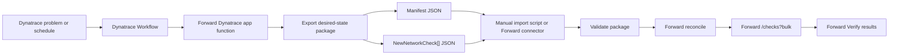

# Forward Dynatrace Workflow

This app uses Dynatrace application dependency mapping to fill Forward intent checks. Dynatrace is the source of
application dependency evidence; Forward is the system that stores, evaluates, reconciles, and reports the network
intent.

This repository is a Forward Field Integration reference. It builds Forward-ready payloads and a production API plan,
but it is not an officially supported Forward product integration. The Dynatrace app must not mutate a Forward tenant.
Forward-side manual import or a Forward-side connector owns all intent-check writes.

## What the Dynatrace App Provides

- A focused view of Dynatrace application dependencies that are candidates for Forward intent.
- A path preview action that turns a Dynatrace service/problem context into a Forward path query.
- An export action that stages Forward-ready artifacts:
  - `forward-intent-checks.json` as Forward-native `NewNetworkCheck[]` for bulk intent import.
  - `forward-dynatrace-manifest.json` with schema version, counts, dedupe policy, and artifact names.
- A Workflow-compatible app function that can run without a human clicking the UI.

## Recommended Production Flow



## Screenshots

### 1. Dynatrace Mapping Becomes Forward Intent Candidates

The app starts from Dynatrace application dependencies, not generic infra telemetry.


### 2. Build A Forward Export Package

The workflow produces an export package first: row counts, readiness gates, bulk-check JSON, and manifest. No Forward
writes happen inside Dynatrace.


### 3. Forward-Side Bulk Check Ingest

Eligible rows become Forward-native `NewNetworkCheck[]` JSON. Forward manual import or a Forward-side connector
executes the API calls.


### 4. Forward-Side Persistent Intent Checks

Eligible dependency rows become persistent `Existential` checks with deterministic tags for dedupe, created by
Forward-side ingest.


## Standard Forward-Centric Ingest Sequence

1. Dynatrace app exports dependency rows from Dynatrace services, spans, tags, or ownership metadata.
2. Dynatrace app exports:
   - `forward-intent-checks.json`
   - `forward-dynatrace-manifest.json`
   - deterministic `integration_key` values in each check tag and note.
3. Forward operator imports the package, or Forward-side connector pulls it from a read-only package URL.
4. Forward-side ingest validates package shape, required fields, supported check type, and unique names/tags.
5. Forward-side ingest resolves the snapshot where checks should be created:

   `GET /api/networks/{networkId}/snapshots/latestProcessed`

6. Forward-side ingest reads existing Dynatrace-managed checks:

   `GET /api/snapshots/{snapshotId}/checks?type=Existential`

   Match by deterministic check name or `dynatrace-key:*` tag.

7. Forward-side ingest fingerprints generated fields and produces a reconciliation report:
   - `create`
   - `unchanged`
   - `changed`
   - `stale`

8. Forward-side ingest creates missing persistent intent checks in bulk:

   `POST /api/snapshots/{snapshotId}/checks?bulk`

   Body is `NewNetworkCheck[]`. Persistence defaults to true in Forward's API.

9. Forward-side ingest reads back status:

   `GET /api/snapshots/{snapshotId}/checks?type=Existential`

## Iterative Reconciliation

The automated workflow should treat every export as desired state from Dynatrace, not as a blind append.

Each connector or importer run should compute:

- `new`: `dynatrace-key:*` exists in the package but not in Forward. Create it.
- `unchanged`: key and generated fingerprint match. Skip it.
- `changed`: same key, different generated fingerprint. Update only under the configured policy, or report for review.
- `stale`: key exists in Forward but not in the latest package. Mark for review by default.

The first production-safe policy should auto-create only missing checks. Updates and stale removals should be reviewed
until ownership and retirement rules are explicit.

The importer uses a canonical JSON SHA-256 fingerprint over generated check fields so Forward result fields such as
status, IDs, creators, and timestamps do not create false drift.

## Intent Check Mapping

The first useful mapping is one Forward `Existential` check per eligible Dynatrace dependency:

```json
{
  "name": "[Dynatrace] Checkout prod: checkout-vip -> orders-db tcp/443",
  "enabled": true,
  "priority": "HIGH",
  "tags": [
    "dynatrace",
    "app:Checkout",
    "environment:prod",
    "owner:commerce-platform",
    "dynatrace-key:dt:checkout:prod:service-1234567890:checkout-vip:orders-db:tcp:443"
  ],
  "note": "Generated from Dynatrace service checkout-api; serviceEntityId=SERVICE-1234567890; integrationKey=dt:checkout:prod:service-1234567890:checkout-vip:orders-db:tcp:443",
  "definition": {
    "checkType": "Existential",
    "filters": {
      "from": {
        "location": {"type": "HostFilter", "value": "checkout-vip"},
        "headers": [
          {
            "type": "PacketFilter",
            "values": {"ip_proto": ["6"]}
          },
          {
            "type": "PacketFilter",
            "values": {"tp_dst": ["443"]}
          }
        ]
      },
      "to": {"location": {"type": "HostFilter", "value": "orders-db"}},
      "flowTypes": ["VALID"]
    },
    "headerFieldsWithDefaults": ["url"],
    "noiseTypes": [],
    "returnPath": "ANY"
  }
}
```

Use `Reachability` checks when the dependency must be delivered to the destination host or prefix. Use `NQE` checks
when the question is broader than one path, such as snapshot-wide compliance or segmentation drift. That is separate
from this import package.

Rows with `needs-map` status should not create Forward checks. Reject them from automated import until
source/destination mapping is complete.

Forward endpoint mappings must resolve in the target snapshot. `HostFilter` is the default for application host/IP
dependencies, but packages can use `SubnetLocationFilter` or `DeviceFilter` when the mapping process has resolved a
dependency to those Forward location types.

## Workflow Option A: Manual Export And Import

1. Dynatrace operator builds the package and downloads:
   - `forward-dynatrace-manifest.json`
   - `forward-intent-checks.json`
2. Forward operator places those artifacts in a Forward-controlled environment.
3. Forward operator validates the package and runs a dry-run:

   `npm run forward:import -- --checks forward-intent-checks.json --manifest forward-dynatrace-manifest.json`

4. Forward operator reviews the reconciliation report.
5. Forward operator applies:

   `npm run forward:import -- --checks forward-intent-checks.json --manifest forward-dynatrace-manifest.json --apply`

## Workflow Option B: Forward-Side Connector Pull

Here, connector means a process outside Dynatrace that runs in a Forward-controlled or customer-controlled
environment. It has read-only access to the Dynatrace export package and the Forward credentials needed to reconcile
and create checks. The Dynatrace app still never pushes changes into Forward.

1. Dynatrace app or Dynatrace Workflow writes the latest export package to a connector-readable location.
2. Forward-side connector authenticates to Dynatrace with read-only access and pulls the package.
3. Connector validates:
   - `schemaVersion`
   - package age
   - row/check counts
   - required fields
   - allowed check type and tag shape
   - unique check names and `dynatrace-key:*` tags
4. Connector resolves the Forward network and latest processed snapshot.
5. Connector reads existing Forward intent checks.
6. Connector dedupes by exact check name or `dynatrace-key:*` tag.
7. Connector fingerprints generated fields and computes create/unchanged/changed/stale.
8. Connector posts only missing checks to `/api/snapshots/{snapshotId}/checks?bulk`.
9. Connector reports changed and stale checks according to policy.
10. Connector writes import status back to Forward logs, and optionally exposes read-only status in Dynatrace.

The connector command path is the same importer, pointed at a package URL:

```bash
npm run forward:import -- \
  --package-url https://package.example.com/dynatrace-forward/latest/ \
  --report forward-import-report.json \
  --fail-on-drift
```

This command pulls `forward-dynatrace-manifest.json` and `forward-intent-checks.json`, validates both, then performs
the same Forward read-before-write reconciliation as manual import.

## Dynatrace Workflow Triggers

Problem trigger:
- Read impacted service/entity context.
- Query related dependencies for the service and timeframe.
- Export Forward ingest package only for impacted rows.
- Optionally show package generation status in Dynatrace.

Schedule trigger:
- Refresh all critical production dependencies.
- Refresh the export package.
- Forward-side connector decides whether to import the updated package.

## Runtime Requirements

- Dynatrace app scope for reading entities and related observability context.
- No Forward write credentials stored in Dynatrace.
- Forward-side connector or Forward operator owns Forward credentials.
- Idempotency keys or deterministic check names so Forward-side import skips existing checks instead of duplicating them.
- A policy for check ownership, updates, retirement, and exception handling.
