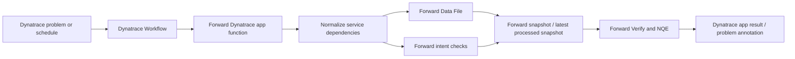

# Forward Dynatrace Workflow

This app should be useful to Dynatrace users first, then publish the same evidence into Forward automatically.

## What the Dynatrace App Provides

- A focused operator view for service dependencies, owners, environments, and confidence.
- A proof action that turns a Dynatrace service/problem context into a Forward path query.
- A sync action that stages two Forward-ready artifacts:
  - `dynatrace_service_dependencies.csv` for NQE and inventory-style analysis.
  - Persistent Forward intent check JSON for Verify.
- A Workflow-compatible app function that can run without a human clicking the UI.

## Recommended Production Flow



## Forward API Sequence

1. Build dependency rows from Dynatrace services, spans, tags, or ownership metadata.
2. Create or update the org-level data file:

   `POST /api/data-files`

   This is a multipart request with:
   - `file`: generated CSV.
   - `request`: JSON metadata such as name, NQE name, file type, description, and headers.

3. Replace existing contents when the file already exists:

   `POST /api/data-files/{dataFileName}`

4. Attach the data file to the target Forward network:

   `POST /api/networks/{networkId}/data-files/{dataFileName}`

5. Optionally trigger a new collection:

   `POST /api/networks/{networkId}/snapshots?async=1`

6. Resolve the snapshot where checks should be created:

   `GET /api/networks/{networkId}/snapshots/latestProcessed`

7. Create persistent intent checks:

   `POST /api/snapshots/{snapshotId}/checks?persistent=true`

8. Read back status:

   `GET /api/snapshots/{snapshotId}/checks?type=Existential`

## Intent Check Mapping

The first useful mapping is one Forward `Existential` check per high-confidence Dynatrace dependency:

```json
{
  "name": "[Dynatrace] Checkout prod: checkout-vip -> orders-db tcp/443",
  "enabled": true,
  "priority": "HIGH",
  "tags": ["dynatrace", "app:Checkout", "environment:prod", "owner:commerce-platform"],
  "definition": {
    "checkType": "Existential",
    "filters": {
      "from": {
        "location": {"type": "HostFilter", "value": "checkout-vip"},
        "headers": [
          {
            "type": "PacketFilter",
            "values": {"ip_proto": ["TCP"], "tp_dst": ["443"]}
          }
        ]
      },
      "to": {"location": {"type": "HostFilter", "value": "orders-db"}},
      "flowTypes": ["VALID"]
    },
    "headerFieldsWithDefaults": ["url"],
    "noiseTypes": [],
    "returnPath": "ANY"
  }
}
```

Use `Reachability` checks when the dependency must be delivered to the destination host or prefix. Use `NQE` checks
when the question is broader than one path, such as dependency coverage, device exposure, segmentation drift, or
snapshot-wide compliance.

## Dynatrace Workflow Triggers

Problem trigger:
- Read impacted service/entity context.
- Query related dependencies for the service and timeframe.
- Generate Forward checks only for impacted rows.
- Read Forward check status and annotate the Dynatrace problem or show the result in the app.

Schedule trigger:
- Refresh all critical production dependencies.
- Update the Forward data file.
- Refresh persistent checks.
- Alert only when Forward result status changes or dependency coverage drops.

## Runtime Requirements

- Dynatrace app scope for reading entities and related observability context.
- Forward API credentials stored server-side, not in browser state.
- Forward host allow-listed in Dynatrace External requests, or EdgeConnect for private Forward.
- Idempotency keys or deterministic check names so reruns update or skip existing checks instead of duplicating them.
